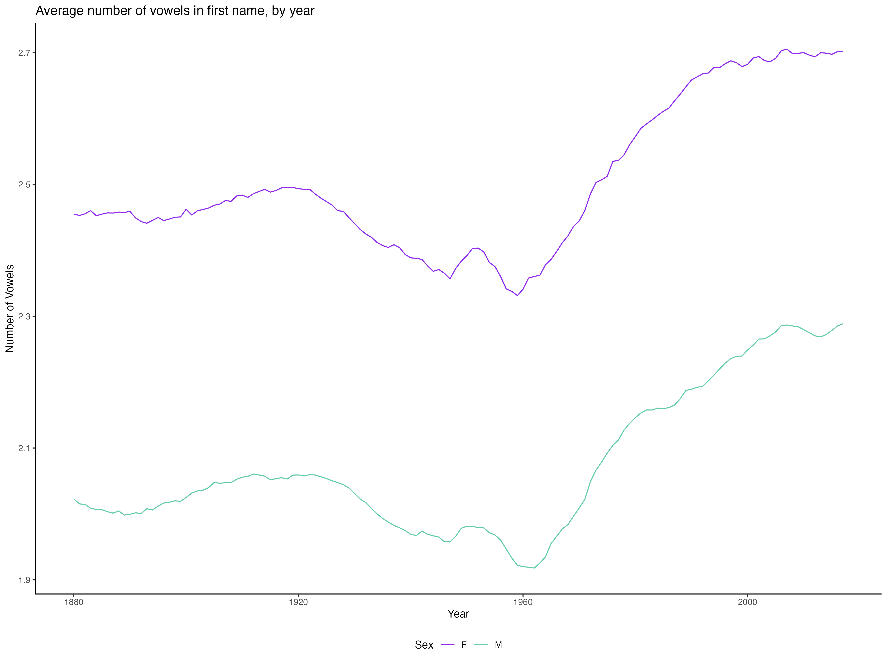

# 531 Midterm Project: Complexity of US Baby Names

TO DO - 2/10

Xinhe - Use the arima function as covered in class, create an AIC table and look more carefully at diagnostics.
Jaylin - Same as above, but using arima2 function with idea of comparing results. 
Yiheng - Look through past projects AND past peer review so we can start working on that scholarship part of the project. 

We plan to explore how the complexity of baby names in the US has changed over time, 
using the `babynames` dataset available in R. Specifically, we will look at three
attributes of names over time, separated by gender:

1. Average length
2. Average number of vowels
3. Average longest run of consonants 

For each question, we calculate the attribute in question for every person included 
in the dataset and find the average over everyone born in a particular year. 
The `babynames` dataset includes data on all births reported to the Social 
Security Administration from 1880 to 2017, excluding those who were given a name 
with less than five uses for a particular gender and year. 

 
